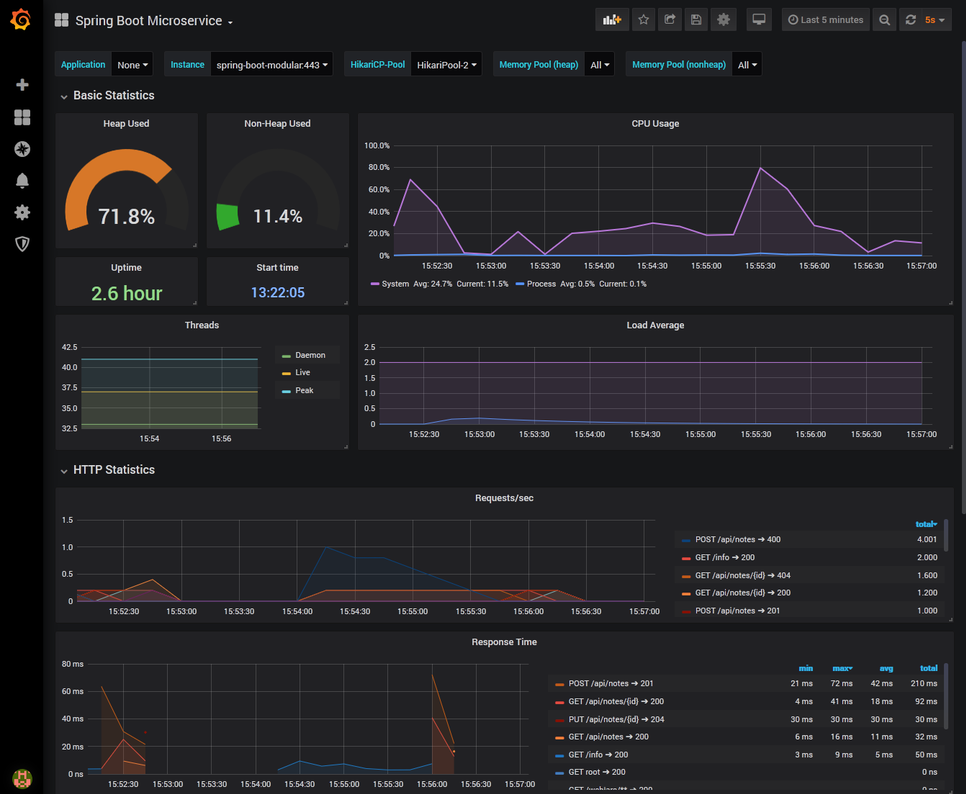

# Spring Boot Modular Project

## Description

Spring boot project with

* **Java 11**
* **TLS enabled** and properly configured (optionally redirecting HTTP to HTTPS when enabling the HTTP port).
* **HTTP2 enabled** (on JRE 11+)
* **JWT** authentication

Features:
* **Modular architecture**: App, Platform and common / business modules
* API (Service, DTO, Exception)
* Persistence (Spring Data Repository, JPA)
* Service Layer
* REST controller (CRUD)

* **Access Log** filter, logging all requests (method, URI, response status and execution time)
* **Performance Logging** filter, logging performance tree of nested service calls
* **Docker support** (Docker and Docker-Compose files), with **Prometheus** monitoring / **Grafana** dashboard.

### Setting up TLS

The application uses a TLS server certificate issued by a test CA (certificate authority).
Clients need to trust this CA in order to connect. The test client already has a properly set up client truststore including this CA certificate.

When connecting with other clients (browser, Postman, ...), you need to add this CA as trusted root CA (browser: certificates, add trusted root certificate).
The CA certificate is located in the project root (`test_ca_001.cer`).

### Setting up JWT authentication

JWTs (JSON Web Tokens) are used for authentication. For testing purpose, this app
contains a REST endpoint where JWT tokens can be issued for any user. 

Signing and verifying JWTs requires a Key Pair (private key for signing, public key for verifying).
An example key pair is already included and configured. To create your own key pair, use:

    ssh-keygen -t rsa -b 4096 -m PEM -f jwt.key

Do not enter a password (not required). Afterwards extract the private and public keys into separate files:

    openssl rsa -in jwt.key -pubout -outform PEM -out jwt.pub.pem
    openssl pkcs8 -topk8 -inform PEM -outform PEM -in jwt.key -out jwt.pem -nocrypt

This yields the `jwt.pem` private key and `jwt.pub.pem` public key.

In the configuration (`application-yml`), enable JWT authentication using:

    ch.frostnova.platform.security:
      jwt:
        key-type: RSA
        public-key: jwt.pub.pem
        private-key: jwt.pem

- `public-key` is required to validate JWT tokens.
- `private-key` is optional, if configured the application can issue arbitrary JWT tokens in the `/login` endpoint (only for testing - do not use for production. Refer to swagger-ui for usage).

## Build

To build this project with Gradle (default tasks: _clean build install_):

    gradle
    
## Start
    
To start this project with Gradle:
    
    gradle start

## API Documentation (Swagger)

API documentation available at [https://localhost:8443/swagger-ui.html](https://localhost/swagger-ui.html).

The note endpoint requires authentication using JWT (header: Authorization: Bearer {jwt}).

## Actuator Endpoints

* Info: https://localhost:8443/actuator/info
* Health: https://localhost:8443/actuator/health
* Metrics: https://localhost/actuator/metrics
* Prometheus: https://localhost/actuator/prometheus
* HTTP request metrics: https://localhost:8443/actuator/metrics/http.server.requests

## Docker

This project is dockerized using Docker Compose. The docker configuation resides in the `docker/config` 
directory. Common tasks and docker-compose commands 
(some tasks can be executed using the docker-compose gradle plugin):

| Task          | with docker-compose | with gradle |
| -------------:|:---------------------|------------|
| **Deploy/Start**      | `docker-compose up -d` | `gradle composeup` |
| Build images      | `docker-compose build` | `gradle composebuild` |
| Follow logs | `docker logs -f spring-boot-modular` | - |
| Download logs | - | `gradle composelogs` |
| **Stop/undeploy**      | `docker-compose down` |  `gradle composedown` |
| Stop/undeploy,  remove volumes and images | `docker-compose down -v --rmi local` | - |

    
### Monitoring

The `docker-compose` file also includes Prometheus and Grafana, along with a preconfigured dashboard.

Open the dashboard at port 3000, e.g. http://localhost:3000, with user `admin` and password `admin`:

## Housekeeping

### Dependency management
To check for dependency updates, run:

    gradle dependencyUpdates
    
This will report all available newer versions of the dependencies, so you can update them in the `build.gradle`.
